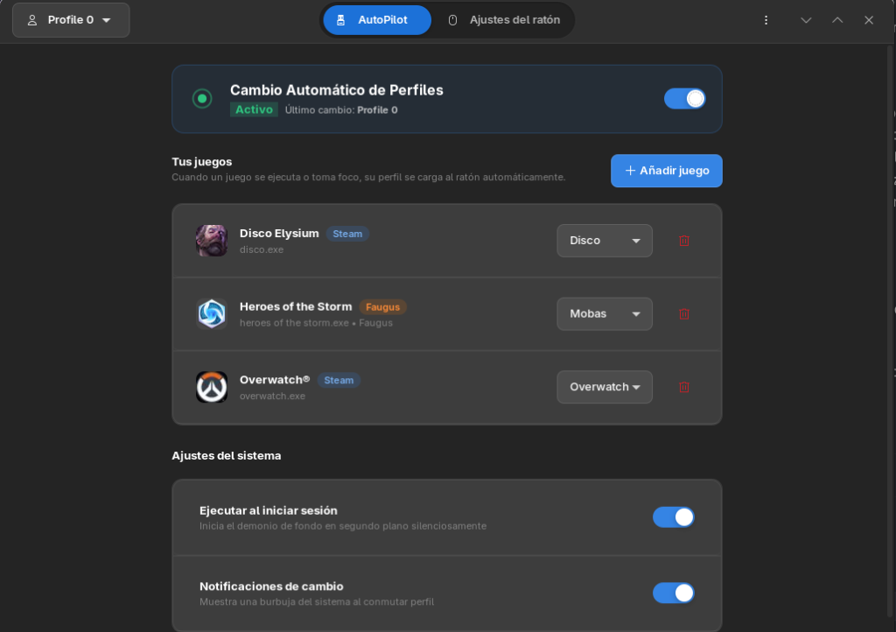
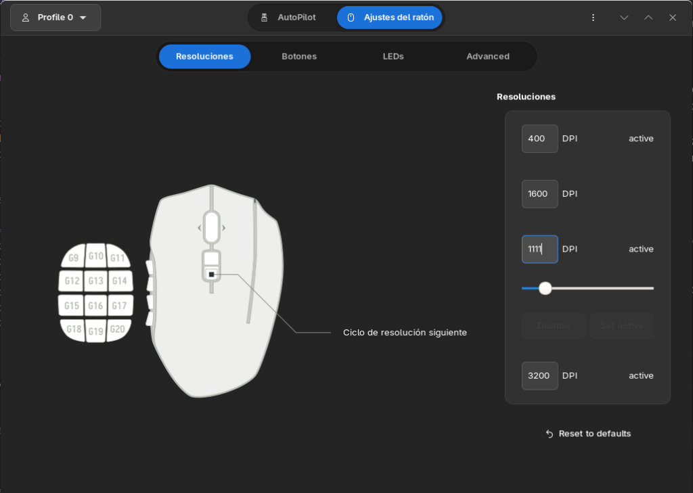

<p align="center">
  <picture>
    <source media="(prefers-color-scheme: dark)" srcset="data/io.github.rilorca.Cheddar-symbolic.svg">
    
  </picture>
</p>

<h1 align="center">Cheddar</h1>

<p align="center">
  <strong>The Missing Logitech G HUB Experience for Linux 🧀🖱️</strong><br>
  <em>Smart per-game profile switching, endless custom profiles, native Rust autopilot daemon, and zero-hassle gaming mouse management.</em>
</p>

<p align="center">
  <a href="#why-cheddar">Why Cheddar?</a> •
  <a href="#screenshots">Screenshots</a> •
  <a href="#features">Features</a> •
  <a href="#architecture">Architecture</a> •
  <a href="#installation">Installation</a> •
  <a href="#releasing">Generating a Release</a> •
  <a href="#troubleshooting">Troubleshooting</a>
</p>

---

## Why Cheddar?

On Windows, Logitech G HUB automatically detects when you launch a game and reconfigures your mouse instantly with your custom keybindings, DPI resolutions, and macros. On Linux, gamers were previously stuck with static onboard profiles or manual tools.

**Cheddar changes the game.** Built with modern Libadwaita aesthetics as a supercharged evolution of [Piper](https://github.com/libratbag/piper), Cheddar brings full-featured automation and mouse tuning to the Linux desktop:

- 🎮 **Zero-Effort AutoPilot:** Launch Steam, Proton, Lutris, Heroic, or Faugus Launcher games, and your mouse profile switches instantly in the background. Alt-tab between games or back to the desktop, and your settings follow seamlessly.
- ♾️ **Unlimited Game Profiles:** Don't let your mouse's onboard memory slots limit your gaming library. Cheddar stores unlimited custom profiles on your PC and dynamically writes them onto your mouse hardware on the fly.
- 🦀 **Native Rust Daemon (~4-8 MB RAM):** Cheddar includes a dedicated, compiled background daemon written in Rust (`cheddar-autopilot`). It idles at just **~4-8 MB of RAM** and **0.0% CPU**, keeping your machine's full power dedicated to your games.
- 🎯 **Full Hardware Synchronization:** Real-time DPI stage tracking (including physical mouse DPI buttons), desktop notifications, and tray state indicators that update instantaneously.
- 🖱️ **Universal Device Support:** Fully supports over **70+ Logitech gaming mice** (G502 Hero/Lightspeed/X, G Pro / Superlight, G305, G203, G600, G703, G903, G403, etc.) as well as mice from SteelSeries, Roccat, and ASUS supported by `libratbag`.

---

## Screenshots

<div align="center">
  <h3>AutoPilot — Automatic Game Profile Switching</h3>
  
  <p><em>Automatically detect running games, assign custom mouse profiles, and configure background autostart with a modern Libadwaita interface.</em></p>
  <br>

  <h3>Hardware Configuration & DPI Resolutions</h3>
  
  <p><em>Fine-tune sensitivity levels, switch active DPI presets, and remap buttons with interactive real-time mouse SVG visualization.</em></p>
</div>

---

## Features

- **Per-Game Profile Switching:** Map any game to a custom profile. Cheddar applies it when the game launches and reverts to your default profile when it closes.
- **Focus-Aware (Alt-Tab Follows You):** When running multiple games or alt-tabbing to your browser, Cheddar instantly gives priority to the focused window.
- **Full Wine / Proton / UMU & Native Support:** Seamlessly detects Windows games running under Proton/Wine (including Battle.net, Steam, Lutris, Heroic, and Faugus Launcher), not just native Linux executables.
- **Automated Game Library Indexing:** The rule editor automatically scans and displays your installed games with high-resolution artwork—no guesswork or manual binary paths required.
- **System Tray (StatusNotifierItem):** Clean, native system tray with:
  - `Abrir Cheddar` (opens the configuration GUI)
  - `Cerrar Cheddar` (closes the app and daemon)
  - Active profile status display
  - Real-time active DPI display (synchronized with mouse hardware buttons)
- **Adaptive Symbolic Icon:** Includes a 3D perspective symbolic vector icon that automatically respects system dark and light modes.
- **Unlimited Software Profiles:** Store hundreds of named profiles on your disk; Cheddar uses an onboard scratch slot to flash them to the mouse seamlessly.

---

## Architecture

Cheddar uses a modern hybrid architecture:

| Component | Technology | Role |
| :--- | :--- | :--- |
| **Cheddar GUI** | Python 3 + GTK 3 + Libadwaita | Visual configuration, profile editor, button remapping, LED controls, rule management. |
| **AutoPilot Daemon** | Rust + Tokio + zbus + ksni | Lightweight background service (`cheddar-autopilot`). Monitors processes, listens to D-Bus `ratbagd` signals, manages the system tray, and triggers desktop notifications. |

When the Rust daemon is running, the GUI detects it automatically and operates in zero-conflict coordination mode.

---

## Installation

### Method 1: Flatpak (Universal / Recommended for GUI) 📦

Cheddar is available as a Flatpak bundle compatible with all major Linux distributions (Arch Linux, Fedora, Ubuntu, Debian, Steam Deck / SteamOS, Bazzite, openSUSE, etc.).

> [!NOTE]
> Cheddar communicates with the host system's `ratbagd` daemon via D-Bus. Ensure `ratbagd` is installed and running on your host system:
> ```sh
> sudo systemctl enable --now ratbagd
> ```

#### Option A: Download Pre-built Bundle
1. Download `io.github.rilorca.Cheddar.flatpak` from the [Latest GitHub Release](https://github.com/Rilorca/cheddar/releases).
2. Install via terminal:
   ```sh
   flatpak install io.github.rilorca.Cheddar.flatpak
   ```
   *(Or double-click the `.flatpak` file to open it in GNOME Software or KDE Discover).*

#### Option B: Build Flatpak Locally
```sh
# Install flatpak-builder
sudo pacman -S flatpak-builder  # Arch
# sudo apt install flatpak-builder  # Debian/Ubuntu
# sudo dnf install flatpak-builder  # Fedora

# Build and install locally
flatpak-builder --user --install --force-clean build-dir io.github.rilorca.Cheddar.json
```

---

### Method 2: Native Installation (Full GUI + Rust Daemon) ⚡

Building natively compiles both the Python graphical app and the native Rust AutoPilot daemon.

#### Dependencies by Distribution

<details>
<summary><b>Arch Linux / CachyOS / Manjaro</b></summary>

```sh
# 1. Install dependencies
sudo pacman -S --needed meson ninja rust cargo libratbag gtk3 python-gobject \
                        python-lxml python-evdev python-cairo xorg-xprop

# 2. Enable mouse daemon
sudo systemctl enable --now ratbagd
```
</details>

<details>
<summary><b>Fedora / Nobara / RHEL</b></summary>

```sh
# 1. Install dependencies
sudo dnf install meson ninja-build rust cargo libratbag-ratbagd gtk3 python3-gobject \
                 python3-lxml python3-evdev python3-cairo xprop

# 2. Enable mouse daemon
sudo systemctl enable --now ratbagd
```
</details>

<details>
<summary><b>Debian / Ubuntu / Linux Mint / Pop!_OS</b></summary>

```sh
# 1. Install dependencies
sudo apt update
sudo apt install meson ninja-build cargo rustc ratbagd gir1.2-gtk-3.0 python3-gi \
                 python3-lxml python3-evdev python3-cairo x11-utils

# 2. Enable mouse daemon
sudo systemctl enable --now ratbagd
```
</details>

#### Build and Install

```sh
# 1. Clone the repository
git clone https://github.com/Rilorca/cheddar.git
cd cheddar

# 2. Configure and build (compiles GUI + Rust daemon)
meson setup builddir --prefix=/usr
ninja -C builddir

# 3. Install system-wide
sudo ninja -C builddir install

# 4. Enable the AutoPilot user service (runs automatically on login)
systemctl --user enable --now cheddar-autopilot
```

*(Tip: To install for your user only without `sudo`, use `meson setup builddir --prefix=$HOME/.local` and run `ninja -C builddir install`)*.

---

### Method 3: Standalone Rust Daemon (Headless / Minimalist) 🦀

If you want the background profile switcher and system tray running with minimal overhead without installing the full GUI:

1. Download `cheddar-autopilot-linux-x86_64.tar.gz` from [GitHub Releases](https://github.com/Rilorca/cheddar/releases).
2. Extract and install:
   ```sh
   tar -xvf cheddar-autopilot-linux-x86_64.tar.gz
   sudo cp cheddar-autopilot /usr/local/bin/
   mkdir -p ~/.config/systemd/user/
   cp cheddar-autopilot.service ~/.config/systemd/user/
   systemctl --user daemon-reload
   systemctl --user enable --now cheddar-autopilot
   ```

---

## Releasing

To create a new release and automatically build the Flatpak bundle and Rust daemon binaries:

1. Ensure all changes are committed on `main`.
2. Create and push a version tag:
   ```sh
   git tag v0.8.1
   git push origin v0.8.1
   ```
3. GitHub Actions (`.github/workflows/flatpak-release.yml`) will automatically:
   - Build `io.github.rilorca.Cheddar.flatpak`
   - Compile `cheddar-autopilot` (Rust daemon release binary)
   - Create a GitHub Release with release notes and attach both assets.

---

## Troubleshooting

- **"Cannot find any devices" / Welcome screen:** `ratbagd` isn't running or your mouse needs re-enumeration. Run `sudo systemctl start ratbagd` and replug the mouse.
- **Solaar conflict (Logitech wireless mice):** If [Solaar](https://pwr-solaar.github.io/Solaar/) is running when `ratbagd` starts, it may claim the device first, causing `ratbagd` to fail reading profiles. Stop Solaar (`killall solaar`), restart ratbagd (`sudo systemctl restart ratbagd`), and replug your mouse.
- **Check Daemon Logs:**
  ```sh
  journalctl --user -u cheddar-autopilot -f
  ```
- **Restart Daemon:**
  ```sh
  systemctl --user restart cheddar-autopilot
  ```

---

## Contributing & Development

To test and develop without installing system-wide:

```sh
meson setup builddir
ninja -C builddir
./builddir/cheddar.devel
```

Run test suites:
```sh
# Meson & Python unit tests
ninja -C builddir test

# Rust daemon unit tests
cargo test --manifest-path daemon-rs/Cargo.toml
```

---

## License

GPL-2.0-or-later, same as upstream Piper. See [COPYING](COPYING).  
Cheddar is built on the foundation of [Piper](https://github.com/libratbag/piper) by the libratbag project.
